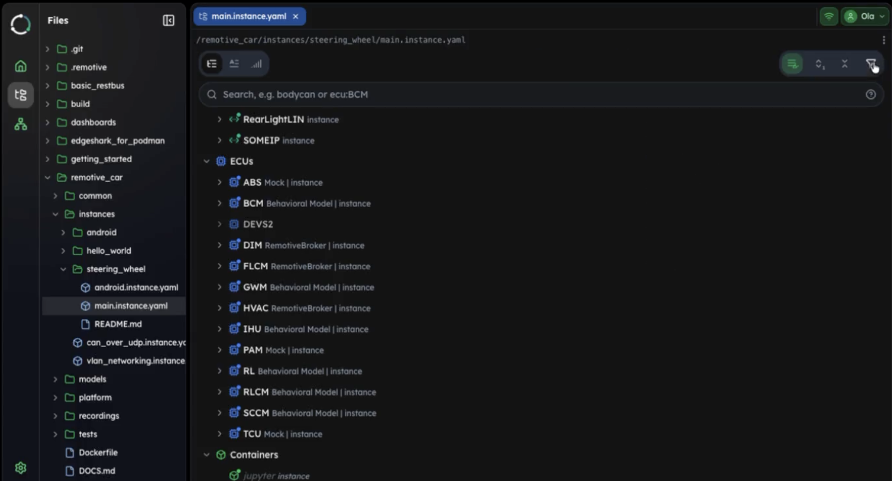

RemotiveStudio's Tree view now lets you explore frames and signals directly on each channel and ECU - no more switching between tools to understand what's available in your topology.

## What's New

Previously, finding which signals are available on a channel or ECU required opening signal databases separately. Now you can:

- **Expand any channel** to see all frames and signals transmitted on it
- **Expand any ECU** to see which frames it transmits and receives
- **View signal details** like type, range, and unit directly in the tree
- **Search and filter** to quickly find specific frames or signals


*The new Tree view showing frames and signals for channels and ECUs*

## Why It Matters

This streamlines your workflow when:
- **Writing tests** - Find signal names without opening DBC files
- **Understanding topology** - See complete signal flow across ECUs
- **Debugging** - Verify which signals are available where
- **Team collaboration** - Share a unified view of your platform

## Example: Exploring a Turn Signal System

1. Expand the `DriverCan0` channel → see the `SCCM_TurnSignalStatus` frame
2. Expand the frame → see signals like `TurnStalk.TurnSignal`
3. Navigate to `BCM` ECU → verify it receives and processes the signal
4. Navigate to `FLCM` ECU → see the light control output signals

All in one view, no context switching required.

## Try It

Open any platform or instance file in RemotiveStudio and start exploring:

```bash
remotivestudio platform.yaml
```

The frames and signals are right there in the tree, ready to explore.

---

*Update to the latest RemotiveStudio version to use this feature. [Get started](https://docs.remotivelabs.com/docs/remotive-topology/install) with a free trial.*
